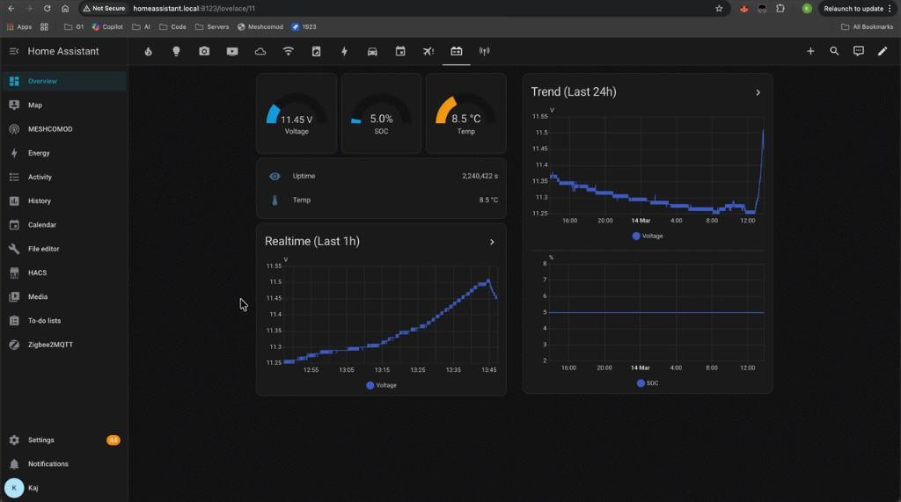

# meshcomod

**MeshCore addon for Heltec WiFi LoRa 32 V4** — an addon on top of [MeshCore](https://github.com/meshcore-dev/MeshCore) firmware, trimmed to this device only. **One build supports three companion transports: USB, Bluetooth, and TCP** (choose any combination; toggle BLE and TCP from the device UI).

Upstream: **[github.com/meshcore-dev/MeshCore](https://github.com/meshcore-dev/MeshCore)** (MeshCore is a lightweight multi-hop LoRa mesh; see their repo for full docs, clients, and flasher.)

> **Experimental — use at your own risk.** This firmware is not officially supported. Flashing custom firmware may have unexpected effects; you are responsible for your use of it. No warranty is provided.  

### Supported devices

- **Heltec WiFi LoRa 32 V4** (ESP32-S3, 128×64 OLED, LoRa)
<p align="left">
  
</p>

- **Heltec WiFi LoRa 32 V3** (ESP32, 128×64 OLED, LoRa)
<p align="left">
  
</p>

**Build env names differ by device:** V4 uses lowercase `heltec_v4_...`; V3 uses a capital H: `Heltec_v3_...`. Use the exact env name when building (see examples below).

---

## What's different in meshcomod

- **USB + Bluetooth + TCP in one build for Heltec V4 & V3**  
  A single firmware image supports **USB, Bluetooth, and TCP** companion connections at the same time (e.g. Home Assistant on USB, MeshCore app on BLE, Web/CLI on TCP). You can use one, two, or all three; BLE and TCP can be turned on or off from the device UI.

  - **USB** — always on when the device is on.  
  - **Bluetooth** — pairing PIN is shown on the Heltec **Bluetooth tab** (the active PIN may be configured or generated by firmware build settings). **Bluetooth tab** shows BLE state and pairing info. **Long press** on this tab enables/disables BLE; footer shows "ON: long press" / "OFF: long press".  
  - **TCP** — server on port **5000** (configurable in HARD mode), multiple clients. 
  WiFi credentials are **not** stored in the repo; set env vars `WIFI_SSID` and `WIFI_PWD` before building (see Build below). You can also configure WiFi at runtime using **Meshcomod** (see below). **Network (TCP) tab**: shows TCP status, IP, port, and **SSID**. **Long press** on this tab to enable or disable TCP; footer shows "ON: long press" / "OFF: long press".

- **Toggle BLE & TCP from within the app**  


- **Configuring WiFi through Meshcomod Console, Flasher WiFi GUI, or through the app**  


  Preferred methods (no CLI Rescue mode needed):
  - **WiFi GUI on [flasher.meshcomod.com](https://flasher.meshcomod.com)** (easiest)
  - **Console on [console.meshcomod.com](https://console.meshcomod.com)** (USB serial)
  - **Console tab on [flasher.meshcomod.com](https://flasher.meshcomod.com)** (USB serial)

  Console commands:
  - `set wifi.ssid <your SSID>`
  - `set wifi.pwd <your password>` (open network: `set wifi.pwd `)
  - `wifi.apply`
  - `wifi.status`

  You can set WiFi from the existing app with. In the app, open the contact list and find custom contact **Meshcomod**.
  Meshcomod appears at the **bottom of the contacts list**.
  **Important:** Meshcomod chat is **local-only** command handling on the companion device. Commands/replies in the Meshcomod chat are **not transmitted over LoRa mesh** and are not forwarded to other mesh nodes.

  Meshcomod chat works with these local-only commands:
  - `help` — show all Meshcomod commands.
  - `status` — show general companion status (USB/BLE/TCP and WiFi state).
  - `wifi set ssid <your SSID>` — set SSID (use quotes if it contains spaces, e.g. `wifi set ssid "My Home WiFi"`).
  - `wifi set pwd <password>` — set password (use `wifi set pwd ""` for open networks).
  - `wifi scan` — list nearby SSIDs with index; then select with `wifi use <n>`.
  - `wifi use <n>` — set SSID to one from the last scan list.
  - `wifi status` — show current SSID, runtime vs compile-time creds, and connection status.
  - `wifi apply` — reconnect using the stored credentials (after changing SSID/password).
  - `wifi clear` — clear stored runtime credentials (device will use compile-time `WIFI_SSID`/`WIFI_PWD` on next boot if built with them).
  - `tcp on | tcp off | tcp status` — control/query TCP companion server.
  - `ble on | ble off | ble status` — control/query Bluetooth companion.
  - Safety flow for disabling wireless access: `tcp off` and `ble off` require confirmation. The device warns that wireless access may be lost and asks you to reply `ok` (or `cancel`) before applying the change.
  - Note: entering WiFi password in chat may not be ideal because your client can keep local chat history.
  Credentials are stored in NVS and persist across reboots. **WiFi is 2.4 GHz only**; 5 GHz–only networks are not supported.

- **Features (multi-transport)**  
  - **Push to all clients** — RX log, new messages, contact adverts, path updates, and other unsolicited events are sent to **every** connected client (USB and all TCP), so each app sees live updates.  
  - **No duplicate RX log on sync** — When one client loads or syncs history, only that client gets the sync responses; the other clients do not see those frames again, so the RX log does not duplicate on the device that didn't trigger the sync.

- **Build script**  
  `build.sh` can use `python3 -m platformio` when `pio` is not in PATH.

Otherwise this is the same codebase as MeshCore; we sync from upstream and add our addon customizations on top.

---

## Home Assistant tab

You can run the **full meshcomod web client as a tab inside Home Assistant**. Connect your companion device over **TCP (WiFi)** or **USB** to the machine running Home Assistant, then add the [meshcomod client](https://meshcomod.com) as an iframe or panel. That gives you a dedicated **MESHCOMOD** tab in the sidebar with the full client UI: voltage, state of charge (SOC), temperature, uptime, and realtime/trend graphs—all in one place next to your other HA dashboards. The client talks to the device over the same companion protocol (TCP or USB), so you get live data and control without leaving Home Assistant.

<p align="left">
  
</p>

<p align="center">
  
</p>

## Easy (recommended)

<p align="left">
  
</p>

Flash a prebuilt firmware. No local build needed.

Contributors to **upstream MeshCore**: use the `dev` branch for PRs; for larger changes, open an Issue first — see [meshcore-dev/MeshCore](https://github.com/meshcore-dev/MeshCore).

**Latest** prebuilt files (non-merged shown first, then merged):

- Heltec V4 (non-merged): [`prebuilt/heltec_v4_companion_radio_usb_tcp.bin`](prebuilt/heltec_v4_companion_radio_usb_tcp.bin)
- Heltec V4 (merged): [`prebuilt/heltec_v4_companion_radio_usb_tcp-merged.bin`](prebuilt/heltec_v4_companion_radio_usb_tcp-merged.bin)
- Heltec V4 **TFT + capacitive touch** meshcomod (build locally; optional prebuilt when released): env `heltec_v4_tft_companion_radio_usb_tcp_touch` — CHSC6x on GPIO 47/48 (RST 44), same USB/TCP/BLE/WebSocket companion as OLED meshcomod.
- Heltec V3 (non-merged): [`prebuilt/Heltec_v3_companion_radio_usb_tcp.bin`](prebuilt/Heltec_v3_companion_radio_usb_tcp.bin)
- Heltec V3 (merged): [`prebuilt/Heltec_v3_companion_radio_usb_tcp-merged.bin`](prebuilt/Heltec_v3_companion_radio_usb_tcp-merged.bin)

If a newer build causes issues, you can use an older version: see the [Release log (RELEASES.md)](RELEASES.md) for versioned prebuilts and rollback links.

Flash steps:

1. Open **[flasher.meshcomod.com](https://flasher.meshcomod.com)**.
2. **Easy mode (recommended):** choose your device + version and flash. Easy mode auto-downloads the selected firmware version for you.
3. **Manual mode:** choose **Custom firmware** and upload your selected `.bin`.
4. Connect via USB, BLE (PIN shown on device display), and/or TCP.

Preferred WiFi setup methods (avoid typing WiFi password in chat):
- **WiFi GUI** on [flasher.meshcomod.com](https://flasher.meshcomod.com)
- **Console** on [console.meshcomod.com](https://console.meshcomod.com)

Console setup (if not using WiFi GUI):

1. Open [console.meshcomod.com](https://console.meshcomod.com) (or use **Console** on [flasher.meshcomod.com](https://flasher.meshcomod.com)) while the device is connected over USB.
2. Run:
   - `set wifi.ssid YourSSID`
   - `set wifi.pwd YourPassword` (open network: `set wifi.pwd `)
   - `set wifi.apply` (alias: `wifi.apply`)

   

You do **not** need CLI Rescue/recovery mode for WiFi GUI or console setup. In normal runtime, just connect over USB and configure WiFi directly.

Alternative WiFi setup: Meshcomod chat (works, but password appears in your local chat history):

1. Open contact **Meshcomod** (favourited by default, near bottom of contacts).
2. Run `help` to see available commands.
3. Set WiFi credentials:
   - `wifi set ssid "Your SSID"`
   - `wifi set pwd "YourPassword"` (or `wifi set pwd ""` for open network)
4. Apply:
   - `wifi apply`
5. Check:
   - `status` and/or `wifi status`

> Meshcomod chat is local-only command handling. It does not send commands to the LoRa mesh.
> Even though Meshcomod chat is local-only, entering WiFi password in chat may not be ideal because your client can keep local chat history.
> WiFi companion mode is **2.4 GHz only** (not 5 GHz-only SSIDs).
> If unsure which binary to flash, use **merged**.
> The `prebuilt/` filenames above always point to the latest build for each target. Older snapshot `.bin` files are removed to avoid confusion.

## Hard (build yourself)

<p align="left">
  
</p>

Use this path if you want custom code/build flags.

Dependencies:

- `git`
- `python3` + `pip`
- `platformio` (either `pio` in PATH, or use `python3 -m platformio`)

OS notes:

- macOS: install Xcode Command Line Tools if needed (`xcode-select --install`), then install PlatformIO with pip.
- Linux (Debian/Ubuntu): install tools with `sudo apt update && sudo apt install -y git python3 python3-pip`.
- Windows: recommended via **WSL** (Ubuntu) and follow the Linux steps above.

Quick install example:

```bash
python3 -m pip install --user -U platformio
```

Clone the repository and enter the **MeshCore** directory (this folder). Then set WiFi + version and build (exact env name matters):

- V4 uses lowercase env names: `heltec_v4_...`
- V3 uses capital H env names: `Heltec_v3_...`

#### Heltec V4 meshcomod (OLED) — copy-paste

```bash
cd MeshCore
export WIFI_SSID="YourNetworkName"
export WIFI_PWD="YourPassword"
export FIRMWARE_VERSION=v1.14.1.0
sh build.sh build-firmware heltec_v4_companion_radio_usb_tcp
```

#### Heltec V4 meshcomod (TFT + capacitive touch expansion kit)

Same **WiFi-at-build**, **version**, **`build.sh`**, and **`out/`** layout as OLED V4 above — only the **env name** changes (ST7789 + CHSC6x + full multi-transport companion).

```bash
cd MeshCore
export WIFI_SSID="YourNetworkName"
export WIFI_PWD="YourPassword"
export FIRMWARE_VERSION=v1.14.1.0
sh build.sh build-firmware heltec_v4_tft_companion_radio_usb_tcp_touch
```

**Outputs** (both targets): app-only `out/<env>-<version>-<sha>.bin` and **merged** `out/<env>-<version>-<sha>-merged.bin` (flash from **0x0**, same as prebuilt meshcomod flow). Runtime WiFi override uses the same tools as OLED: flasher WiFi GUI, console.meshcomod.com, or Meshcomod chat `wifi set` / `wifi apply`.

#### Heltec V3 (copy-paste)

```bash
cd MeshCore
export WIFI_SSID="YourNetworkName"
export WIFI_PWD="YourPassword"
export FIRMWARE_VERSION=v1.14.1.0
sh build.sh build-firmware Heltec_v3_companion_radio_usb_tcp
```

For open networks:

```bash
export WIFI_SSID="Cafe Guest"
export WIFI_PWD=""
```

Merged image output:
- `out/Heltec_v3_companion_radio_usb_tcp-<version>-<sha>-merged.bin`
- `.pio/build/Heltec_v3_companion_radio_usb_tcp/firmware-merged.bin`

Build/flash guidance:

- Many users can flash non-merged successfully.
- For first-time flash, boot/display issues, or uncertainty, use **merged** to avoid layout/partition mismatch.

### Black screen after flashing (V3 and V4)

If the display stays black after flashing and resetting:

1. **Prefer merged firmware** — If the display stays black or boot is unstable, flash the **merged** `.bin` (includes bootloader + partition table). Generate it with `pio run -t mergebin -e <env>`; it lands in `.pio/build/<env>/firmware-merged.bin`. (`build.sh` / default `out/` copies are **app-only** `firmware.bin`.)
2. **Flash with the web flasher** — On [flasher.meshcomod.com](https://flasher.meshcomod.com), choose **Custom firmware** and upload the merged file. The flasher uses the correct layout (writes from 0x0).
3. **If it's still black** — Try uploading the merged file again via **Custom firmware**. If the flasher offers an erase option, use it first, then upload the merged `.bin`. This wipes all data (contacts, etc.).
4. **V4 merged only:** If the merged image still gives a black screen on Heltec V4 (while V3 is fine), try flashing the **non-merged** `.bin` at app offset **0x10000** (your device must already have a valid bootloader and partition table from a previous flash). Newer firmware also adds longer pre-display delay and watchdog feeds on first boot to improve merged boot reliability.

Flashing the merged image will **erase the device** and you will lose all contacts and other data. Use the merged build when the display does not come up with the normal flasher flow.

---

## Syncing from upstream MeshCore

```bash
git remote add upstream https://github.com/meshcore-dev/MeshCore.git   # if not already added
git fetch upstream
git merge upstream/main
# resolve any conflicts, then:
git push allfather main
```

### Known bugs

- **Legacy/no-channel clients** — If a client does not implement channel chat, it should ignore channel message frames (0x08, 0x11).
- **Debug monitoring over USB** — When using the USB companion transport, serial terminals show binary companion frames; use BLE/TCP for app traffic if you need clean USB debug logs.
- **BLE first connect quirk** — On first connection over BLE, you may need to disconnect and reconnect once.
- **First help command in Meshcomod** — The first `help` command in a new Meshcomod chat may not reply; if so, send `help` again.
- **Web console command retry** — In some cases, `get/set wifi.*` commands in the web console may not show a reply on first try; run the same command again.

**Home Assistant — use TCP for stability:** The web console (e.g. `set wifi.ssid`) and the companion protocol share the same USB serial port. When Home Assistant is connected over USB, it can be affected by this shared path. **For more stable behaviour, connect Home Assistant to the device over TCP** (WiFi) rather than USB; TCP uses a separate path and is not affected by console handling.

---

## License

Same as MeshCore (see [license.txt](license.txt) in this repo). MeshCore is MIT.
