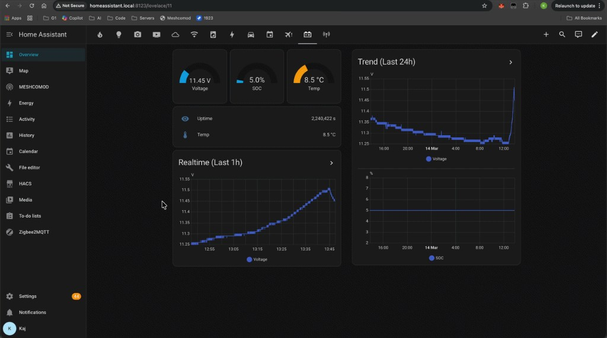

# meshcomod

An addon on top of [MeshCore](https://github.com/meshcore-dev/MeshCore) for **Heltec** and **LilyGo** LoRa devices. It comes in two flavours:

- **🖐️ Touch UI** — a full standalone, on-device interface (LVGL) for the **Heltec V4 TFT** and **LilyGo T-Deck**. Chat, channels, rooms, contacts, a live map, GPS, Wi-Fi/Bluetooth, and over-the-air updates — **no phone required**.
- **📟 Multi-transport companion** — for the OLED / e-ink boards (Heltec V4, V3, Wireless Paper, Xiao). **One build serves USB + Bluetooth + TCP at the same time**, so you drive the radio from a phone app, the web client, or Home Assistant.

Upstream: **[github.com/meshcore-dev/MeshCore](https://github.com/meshcore-dev/MeshCore)** (MeshCore is a lightweight multi-hop LoRa mesh; see their repo for the protocol, mobile clients, and the canonical flasher).

> **Experimental — use at your own risk.** This firmware is not officially supported. Flashing custom firmware may have unexpected effects; you are responsible for your use of it. No warranty is provided.

---

## Which one do I want?

| | **Touch UI** | **Multi-transport companion** |
|---|---|---|
| **Use it like…** | a standalone messenger — read & send right on the device | a radio you pair with a phone app, web client, or Home Assistant |
| **Boards** | Heltec **V4 TFT** (cap-touch), **LilyGo T-Deck** | Heltec **V4** / **V3** OLED, **Wireless Paper**, **Xiao** |
| **Screen** | 240×320 / 320×240 colour TFT + touch | 128×64 OLED / e-ink / headless |
| **Transports** | Wi-Fi **or** Bluetooth (one at a time — see below) + optional companion over TCP | USB **+** Bluetooth **+** TCP, simultaneously |
| **Releases** | `pre-alpha_*` ([TOUCH releases](prebuilt/releases/TOUCH)) | `v1.15.*` ([RELEASES.md](RELEASES.md)) |
| **Jump to** | [Touch UI](#touch-ui) | [Multi-transport companion](#multi-transport-companion) |

Both are the same MeshCore codebase underneath; we sync from upstream and layer the meshcomod additions on top.

### Supported devices

| Device | MCU | Display | Touch / input | Companion env | Touch env |
|---|---|---|---|---|---|
| **Heltec WiFi LoRa 32 V4** | ESP32-S3 | 128×64 OLED | — | `heltec_v4_companion_radio_usb_tcp` | — |
| **Heltec V4 + TFT touch kit** | ESP32-S3 | 240×320 ST7789 | CHSC6x cap-touch | — | `heltec_v4_tft_companion_radio_usb_tcp_touch` |
| **LilyGo T-Deck / T-Deck Plus** | ESP32-S3 | 320×240 ST7789 | GT911 touch + trackball + QWERTY (+ optional GPS) | — | `LilyGo_TDeck_companion_radio_touch` |
| **Heltec WiFi LoRa 32 V3** | ESP32 | 128×64 OLED | — | `Heltec_v3_companion_radio_usb_tcp` | — |
| **Heltec Wireless Paper** | ESP32-S3 | 213×104 e-ink | — | `Heltec_Wireless_Paper_companion_radio_usb_tcp` | — |
| **Seeed Xiao S3 WIO** | ESP32-S3 | optional 128×64 OLED | — | `Xiao_S3_WIO_companion_radio_usb_tcp` | — |

**Env-name casing matters when building:** V4 uses lowercase `heltec_v4_…`; V3 uses a capital H `Heltec_v3_…`; T-Deck is `LilyGo_TDeck_…`. Use the exact name (see [Build it yourself](#hard--build-it-yourself)).

<p align="left">
  
  
</p>

---

## Touch UI

A complete on-device interface for the **Heltec V4 TFT** and **LilyGo T-Deck**. You read and send messages directly on the screen — a phone is optional, not required. Built with LVGL; currently shipping as **pre-alpha** drops in [`prebuilt/releases/TOUCH/`](prebuilt/releases/TOUCH).

### What it does

- **Four bottom tabs** — **Home**, **Chats**, **Contacts**, **Settings** — plus a full-screen **Map**.
- **Chats** — a combined inbox of channels and DMs, sorted by recency, with unread counts and `@`-mention badges. WhatsApp-style bubbles with per-message **Info** (date/time, direction, flood vs direct, hop count, **SNR**, **RSSI**, delivery ✓/✓✓/✗). On-screen QWERTY keyboard (rotatable); the T-Deck's physical keyboard and trackball drive every field.
- **Channels & rooms** — create/join private channels (paste a key or generate one), join the public or hashtag channels, and **Join room servers** (the purple **SRV** contacts) to sync and post room history.
- **Contacts** — filter by All / ★ favourites / Repeaters / Peers, search, and a **Found** list (Discovered ring buffer) of heard-but-not-added nodes with one-tap **Add**. Tap a contact for an action sheet:
  - **Ping** a repeater (SNR/RSSI, 30 s timeout),
  - **Send message**, **Join** (rooms),
  - **Trace route** — a multi-hop SNR profile along the path (DM threads),
  - **Sightline** — when both ends have GPS, a **terrain-aware line-of-sight analyzer**: it pulls a ground-elevation profile, applies a 4/3-earth-curvature model and 0.6·F1 Fresnel clearance, and draws a terrain cross-section with a **LINE OF SIGHT / MARGINAL / NO LINE OF SIGHT** verdict. ± buttons raise/lower each antenna and the graph redraws live.
  - **Delete**.
- **Map** — a full-screen slippy map with your contacts plotted. Tiles render from an on-device offline cache; with Wi-Fi on, missing tiles download and cache automatically (via the meshcomod tile proxy). Each visited place is cached at two zoom levels ("zoom packs") for offline use.
- **GPS** (T-Deck / GPS-equipped) — live fix, distance-to-contact, set the serial baud to match your hardware (T-Deck Plus = 38400, T-Deck v1.0 = 9600).
- **Wi-Fi / Bluetooth** — set SSID/password on-device (with a live **scan** picker), see connection state and IP, and toggle the radio. **NTP** sets the clock automatically once Wi-Fi associates.
- **Over-the-air updates** — **Settings → About → "Install update over Wi-Fi"** pulls the latest release and reboots into it.
- **Power & lock** — configurable screen timeout (default 20 s); the hardware button locks/unlocks the screen. The T-Deck adds a wallpaper **lock screen** with clock, a notification **chime**, and a keyboard-backlight mode.

> A complete, cumulative feature list lives in the per-release notes — see [`prebuilt/releases/TOUCH/pre-alpha_16/notes.md`](prebuilt/releases/TOUCH/pre-alpha_16/notes.md) and earlier drops.

### Bluetooth **or** Wi-Fi — not both at once

This is the one behaviour that surprises people coming from the OLED companion. On the touch boards the ESP32-S3's internal RAM **cannot** hold the Bluetooth stack, the LVGL/TFT UI, **and** Wi-Fi at the same time. So the touch firmware picks **one** companion radio at boot:

- **Wi-Fi credentials saved + Wi-Fi enabled → Wi-Fi mode** (TCP / WebSocket companion, OTA, map tiles, NTP).
- **No Wi-Fi credentials → Bluetooth mode** (BLE companion to the MeshCore phone app).

You switch between them from **Settings → Network**: toggling on/off within the same radio is instant; **switching to the other radio reboots the device** to reclaim the memory. Your data (contacts, channels, chat history, Wi-Fi creds) is untouched by the switch.

### Flash the Touch UI

**Latest prebuilt** (merged includes bootloader + partition table — flash at `0x0`):

- Heltec V4 TFT — merged: [`prebuilt/heltec_v4_tft_companion_radio_usb_tcp_touch-merged.bin`](prebuilt/heltec_v4_tft_companion_radio_usb_tcp_touch-merged.bin) · app-only: [`…_touch.bin`](prebuilt/heltec_v4_tft_companion_radio_usb_tcp_touch.bin)
- LilyGo T-Deck — merged: [`prebuilt/LilyGo_TDeck_companion_radio_touch-merged.bin`](prebuilt/LilyGo_TDeck_companion_radio_touch-merged.bin) · app-only: [`…touch.bin`](prebuilt/LilyGo_TDeck_companion_radio_touch.bin)

Pinned versions (and rollback) live under [`prebuilt/releases/TOUCH/`](prebuilt/releases/TOUCH); each drop has a `notes.md`.

1. Open **[flasher.meshcomod.com](https://flasher.meshcomod.com)**, choose **Custom firmware**, and upload the **merged** `.bin` for your board (writes from `0x0`).
2. On first boot, follow the on-screen setup (name → region → optional Wi-Fi).
3. **Updating an existing touch device:**
   - **On pre-alpha_12 or newer** → just use **Settings → About → "Install update over Wi-Fi"** (no cable).
   - **On pre-alpha_11 or earlier** (or first install) → flash the **merged** image once at `0x0`; OTA works for every release after that. (pre-alpha_12 changed the partition layout to add the second OTA slot — a one-time merged flash is required to migrate, and your data survives it.)

> **T-Deck download mode:** if auto-reset during flashing is flaky, **hold the trackball** while tapping reset, then release once the USB device enumerates. A charge-only cable shows up as "no serial data" — use a **data** cable.

### Touch UI — known issues (pre-alpha_16)

- **DMs from a node whose advert you haven't received yet won't decrypt** (a MeshCore protocol limitation — the receiver needs the sender's full pubkey from a prior advert). Auto-add for chat adverts is on by default.
- **Route trace** needs a known path with forwarding repeaters; a flood-routed contact falls back to a single-hop trace.
- **Map tiles & terrain/elevation** depend on the meshcomod proxy being reachable.
- **Multi-byte routing** (2/3-byte path hashes) needs **MeshCore ≥ v1.14** on every repeater in the path.
- **Live Wi-Fi scanning** needs Wi-Fi already on (Bluetooth and Wi-Fi can't share the radio heap).
- **QR is share-only** — you can show your contact QR; an on-device camera scanner isn't shipped yet.
- **Emoji render monochrome**; the display path has no colour emoji.
- **Heltec V4** has no charge-detect hardware (battery shows measured cell %, no "charging" state) and no speaker (no sound). The **T-Deck** has both.

---

## Multi-transport companion

For the OLED / e-ink / headless boards (Heltec V4, V3, Wireless Paper, Xiao). The headline feature: **a single firmware image serves USB, Bluetooth, and TCP companions at the same time** — e.g. Home Assistant on USB, the MeshCore app on BLE, and the web client on TCP, all at once. Use one, two, or all three; BLE and TCP can be toggled on the device.

- **USB** — always on when the device is powered.
- **Bluetooth** — pairing PIN is shown on the device's **Bluetooth tab** (state + pairing info). **Long-press** the tab to enable/disable BLE; the footer reads "ON: long press" / "OFF: long press".
- **TCP** — server on port **5000**, multiple clients. The **Network (TCP) tab** shows status, IP, port, and SSID. **Long-press** to enable/disable TCP. Wi-Fi credentials are **not** stored in the repo — set them at build time (`WIFI_SSID` / `WIFI_PWD`) or at runtime (below). The plain WebSocket port is **8765** (`ws://` only).


Other companion niceties:

- **Push to all clients** — RX log, new messages, contact adverts, and path updates are sent to **every** connected client, so each app sees live updates.
- **No duplicate RX log on sync** — when one client syncs history, only that client gets the sync frames; the others don't see them re-echoed.

### Home Assistant tab

Run the **full meshcomod web client as a tab inside Home Assistant**. Connect the device over **TCP (Wi-Fi)** or **USB** to the machine running HA, then add the [meshcomod client](https://meshcomod.com) as an iframe/panel for a dedicated **MESHCOMOD** sidebar tab: voltage, state of charge, temperature, uptime, and realtime/trend graphs alongside your other dashboards.

<p align="left">
  
</p>

> **Use TCP for stability in Home Assistant.** The web console and the companion protocol share the USB serial port, so a USB-connected HA can be affected by console handling. **Connect HA over TCP (Wi-Fi)** for a separate, unaffected path.

---

## Configure Wi-Fi (companion mode)

Three ways, no CLI recovery mode needed. **Wi-Fi is 2.4 GHz only** (not 5 GHz-only SSIDs); credentials are stored in NVS and survive reboots.

**1. Flasher Wi-Fi GUI (easiest)** — the Wi-Fi panel on [flasher.meshcomod.com](https://flasher.meshcomod.com).

**2. Web/USB console** — [console.meshcomod.com](https://console.meshcomod.com) (or the Console tab on the flasher), device on USB:

```
set wifi.ssid YourSSID
set wifi.pwd  YourPassword     # open network: set wifi.pwd
wifi.apply
wifi.status
```


**3. Meshcomod chat** — open the built-in **Meshcomod** contact (favourited by default, near the bottom of the contact list) and send commands. **These are handled locally on the device and are *not* sent over the LoRa mesh.** Note your client may keep the password in local chat history.

| Command | What it does |
|---|---|
| `help` | List all Meshcomod commands |
| `status` | USB/BLE/TCP and Wi-Fi state |
| `wifi set ssid "<v>"` | Set SSID (quote if it has spaces) |
| `wifi set pwd "<v>"` | Set password (`""` for open) |
| `wifi scan` / `wifi use <n>` | List nearby SSIDs, then pick one |
| `wifi status` | SSID, runtime vs compile-time creds, link state |
| `wifi apply` | Reconnect with stored credentials |
| `wifi clear` | Clear runtime creds (fall back to compile-time on next boot) |
| `tcp on` / `tcp off` / `tcp status` | Control/query the TCP server |
| `ble on` / `ble off` / `ble status` | Control/query Bluetooth |

> Disabling wireless access is guarded: `tcp off` and `ble off` ask you to confirm with `ok` (or `cancel`) first, since you could lock yourself out.

---

## Easy — flash a prebuilt

<p align="left">
  
</p>

No local build needed. The `prebuilt/` filenames always point at the **latest** build for each target; pinned versions for rollback live under `prebuilt/releases/` and in [RELEASES.md](RELEASES.md) (companion) / [`prebuilt/releases/TOUCH/`](prebuilt/releases/TOUCH) (touch).

**Latest companion builds:**

- Heltec V4 OLED — [merged](prebuilt/heltec_v4_companion_radio_usb_tcp-merged.bin) · [app-only](prebuilt/heltec_v4_companion_radio_usb_tcp.bin)
- Heltec V3 OLED — [merged](prebuilt/Heltec_v3_companion_radio_usb_tcp-merged.bin) · [app-only](prebuilt/Heltec_v3_companion_radio_usb_tcp.bin)

**Latest touch builds:** see [Flash the Touch UI](#flash-the-touch-ui) above.

Flash steps:

1. Open **[flasher.meshcomod.com](https://flasher.meshcomod.com)**.
2. **Easy mode (recommended):** pick your device + version; the flasher downloads it for you.
3. **Manual mode:** choose **Custom firmware** and upload a `.bin`.
4. Connect via USB, BLE (PIN on the display), and/or TCP.

> If unsure which binary to flash, use **merged** (it includes the bootloader + partition table and writes from `0x0`).

---

## Hard — build it yourself

<p align="left">
  
</p>

For custom code or build flags.

**Dependencies:** `git`, `python3` + `pip`, and `platformio` (`pio` in PATH, or `python3 -m platformio`). `build.sh` falls back to `python3 -m platformio` when `pio` isn't on PATH.

- macOS: `xcode-select --install`, then `python3 -m pip install --user -U platformio`
- Linux: `sudo apt update && sudo apt install -y git python3 python3-pip`, then the pip install
- Windows: use **WSL** (Ubuntu) and follow the Linux steps

Clone the repo and build with the exact env name. Companion builds bake Wi-Fi credentials in at build time (override at runtime later); touch builds don't need them (set Wi-Fi on the device).

#### Heltec V4 companion (OLED)

```bash
export WIFI_SSID="YourNetworkName"
export WIFI_PWD="YourPassword"          # open network: export WIFI_PWD=""
export FIRMWARE_VERSION=v1.15.0.5
sh build.sh build-firmware heltec_v4_companion_radio_usb_tcp
```

#### Heltec V3 companion (note the capital H)

```bash
export WIFI_SSID="YourNetworkName"
export WIFI_PWD="YourPassword"
export FIRMWARE_VERSION=v1.15.0.5
sh build.sh build-firmware Heltec_v3_companion_radio_usb_tcp
```

#### Heltec V4 TFT — Touch UI

```bash
export FIRMWARE_VERSION=pre-alpha_local
sh build.sh build-firmware heltec_v4_tft_companion_radio_usb_tcp_touch
```

#### LilyGo T-Deck — Touch UI

```bash
export FIRMWARE_VERSION=pre-alpha_local
sh build.sh build-firmware LilyGo_TDeck_companion_radio_touch
```

**Outputs** (every target): app-only `out/<env>-<version>-<sha>.bin` and **merged** `out/<env>-<version>-<sha>-merged.bin` (flash from `0x0`). The merged image is also at `.pio/build/<env>/firmware-merged.bin`.

### Black screen after flashing

If the display stays black after flashing and resetting:

1. **Flash the merged image** — it includes the bootloader + partition table. Generate with `pio run -t mergebin -e <env>` → `.pio/build/<env>/firmware-merged.bin`. (Default `out/` copies are app-only.)
2. **Use the web flasher** — on [flasher.meshcomod.com](https://flasher.meshcomod.com), **Custom firmware** → upload the merged file (writes from `0x0`).
3. **Still black?** — upload the merged file again; if the flasher offers **erase**, erase first then upload (this wipes contacts and other data).
4. **Heltec V4 only:** if a merged image still gives a black screen (while V3 is fine), try the **non-merged** `.bin` at offset `0x10000` (the device must already have a valid bootloader + partition table). Newer firmware also adds a longer pre-display delay and watchdog feeds on first boot to improve merged-boot reliability.

---

## Docs

- [Companion protocol](docs/companion_protocol.md) · [CLI commands](docs/cli_commands.md) · [QR codes](docs/qr_codes.md)
- [Packet format](docs/packet_format.md) · [Payloads](docs/payloads.md) · [Stats binary frames](docs/stats_binary_frames.md)
- [Device WebSocket / Wi-Fi](docs/DEVICE_WEBSOCKET_WIFI.md) · [FAQ](docs/faq.md) (incl. T-Deck DFU & GPS)
- [Release process](docs/RELEASE_PROCEDURE.md) · [Release log](RELEASES.md)

---

## Syncing from upstream MeshCore

```bash
git remote add upstream https://github.com/meshcore-dev/MeshCore.git   # if not already added
git fetch upstream
git merge upstream/main
# resolve any conflicts, then:
git push origin main
```

Contributing to **upstream MeshCore**? Use their `dev` branch for PRs; open an Issue first for larger changes — see [meshcore-dev/MeshCore](https://github.com/meshcore-dev/MeshCore).

### Companion known quirks

- **Legacy/no-channel clients** — a client that doesn't implement channel chat should ignore channel message frames (`0x08`, `0x11`).
- **Debug over USB** — serial terminals show binary companion frames on the USB transport; use BLE/TCP for app traffic if you need clean USB logs.
- **BLE first connect** — on the first BLE connection you may need to disconnect and reconnect once.
- **First Meshcomod `help`** — the first `help` in a fresh Meshcomod chat may not reply; send it again.
- **Web console retry** — a `get/set wifi.*` command may not show a reply on the first try; run it again.

---

## License

Same as MeshCore (see [license.txt](license.txt)). MeshCore is MIT.
